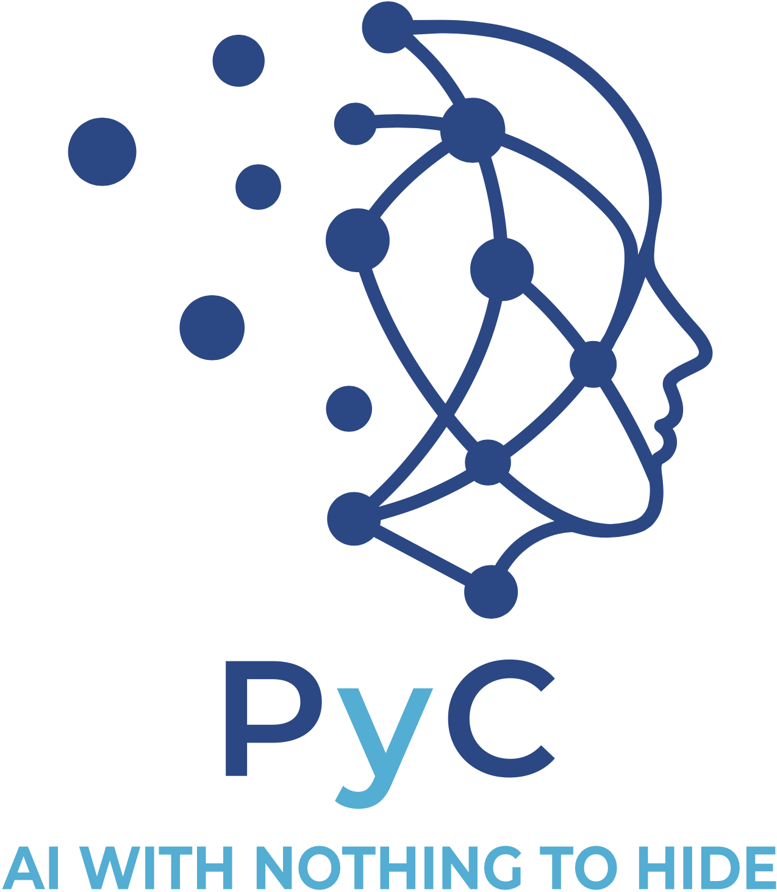
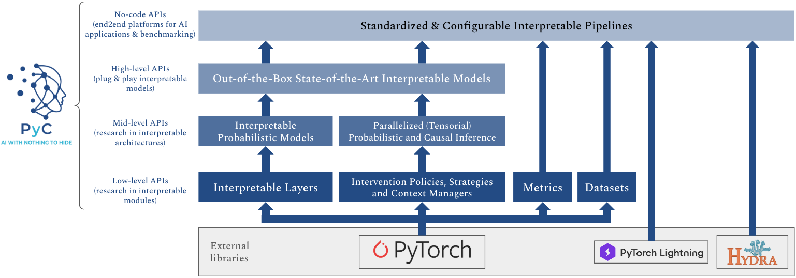

|

PyC is a library built upon PyTorch to easily implement **interpretable and causally transparent deep learning models**.
The library provides primitives for layers (encoders, predictors, special layers), Probabilistic Models, and APIs for running experiments at scale.

The name of the library stands for both:

- **PyTorch Concepts**: as concepts are essential building blocks for interpretable deep learning.
- **P(y|C)**: as the main purpose of the library is to support sound probabilistic modeling of the conditional distribution of targets *y* given concepts *C*.

Quick Start
-----------

You can install PyC along with all its dependencies from `PyPI <https://pypi.org/project/pytorch-concepts/>`_:

.. code-block:: bash

   pip install pytorch-concepts

and then import it in your Python scripts as:

.. code-block:: python

   import torch_concepts as pyc

- Examples: https://github.com/pyc-team/pytorch_concepts/tree/master/examples
- Book: https://pyc-team.github.io/pyc-book/

PyC Software Stack
------------------

The library is organized to be modular and accessible at different levels of abstraction:

- **No-code APIs. Use case: applications and benchmarking.** These APIs allow to easily run large-scale highly parallelized and standardized experiments by interfacing with configuration files.
- **High-level APIs. Use case: use out-of-the-box state-of-the-art models.** These APIs allow to instantiate use implemented models with 1 line of code.
- **Mid-level APIs. Use case: build custom interpretable and causally transparent Probabilistic Models.** These APIs allow to build new interpretable probabilistic models and run efficient tensorial probabilistic inference using a Probabilistic Model interface.
- **Low-level APIs. Use case: assemble custom interpretable architectures.** These APIs allow to build architectures from basic interpretable layers in a plain pytorch-like interface. These APIs also include metrics, losses, and datasets.

API Reference
-------------

Complete API documentation organized by abstraction level:

.. toctree::
   :maxdepth: 1
   :caption: Low-level API

   modules/nn.base.low
   modules/nn.encoders
   modules/nn.graph
   modules/nn.inference
   modules/nn.policy
   modules/nn.predictors
   modules/nn.dense_layers

.. toctree::
   :maxdepth: 1
   :caption: Mid-level API

   modules/nn.base.mid
   modules/nn.constructors
   modules/nn.inference.mid
   modules/nn.models

.. toctree::
   :maxdepth: 1
   :caption: High-level API

   modules/nn.base.high
   modules/nn.models.high

.. toctree::
   :maxdepth: 1
   :caption: Data

   modules/data.base
   modules/data.dataloaders
   modules/data.datasets
   modules/data.preprocessing
   modules/data.scalers
   modules/data.splitters
   modules/data.annotations
   modules/data.backbone
   modules/data.io
   modules/data.utils

.. toctree::
   :maxdepth: 1
   :caption: Distributions

   modules/distributions

.. toctree::
   :maxdepth: 1
   :caption: Other modules

   modules/nn.loss
   modules/nn.metrics
   modules/nn.propagator
   modules/nn.functional

Contributing
------------

- Use the ``dev`` branch to write and test your contributions locally.
- Make small commits and use `Gitmoji <https://gitmoji.dev/>`_ to add emojis to your commit messages.
- Make sure to write documentation and tests for your contributions.
- Make sure all tests pass before submitting the pull request.
- Submit a pull request to the ``main`` branch.

PyC Book
--------

You can find further reading materials and tutorials in our book
`Concept-based Interpretable Deep Learning in Python <https://pyc-team.github.io/pyc-book/>`_.

Authors
-------

- `Pietro Barbiero <http://www.pietrobarbiero.eu/>`_, Universita' della Svizzera Italiana (CH) and University of Cambridge (UK).
- `Gabriele Ciravegna <https://dbdmg.polito.it/dbdmg_web/gabriele-ciravegna/>`_, Politecnico di Torino (IT).
- `David Debot <https://www.kuleuven.be/wieiswie/en/person/00165387>`_, KU Leuven (BE).
- `Michelangelo Diligenti <https://docenti.unisi.it/en/diligenti>`_, Università degli Studi di Siena (IT).
- `Gabriele Dominici <https://pc.inf.usi.ch/team/gabriele-dominici/>`_, Universita' della Svizzera Italiana (CH).
- `Mateo Espinosa Zarlenga <https://hairyballtheorem.com/>`_, University of Cambridge (UK).
- `Francesco Giannini <https://www.francescogiannini.eu/>`_, Scuola Normale Superiore di Pisa (IT).
- `Giuseppe Marra <https://www.giuseppemarra.com/>`_, KU Leuven (BE).

License
-------

Copyright 2024 Pietro Barbiero, Gabriele Ciravegna, David Debot, Michelangelo Diligenti,
Gabriele Dominici, Mateo Espinosa Zarlenga, Francesco Giannini, Giuseppe Marra.

Licensed under the Apache License, Version 2.0 (the "License"); you may not use this file
except in compliance with the License. You may obtain a copy of the License at:
http://www.apache.org/licenses/LICENSE-2.0.

Unless required by applicable law or agreed to in writing, software distributed under the
License is distributed on an "AS IS" BASIS, WITHOUT WARRANTIES OR CONDITIONS OF ANY KIND,
either express or implied.

See the License for the specific language governing permissions and limitations under the License.

Cite This Library
-----------------

If you found this library useful for your blog post, research article or product, we would be
grateful if you would cite it like this:

.. code-block:: text

   Barbiero P., Ciravegna G., Debot D., Diligenti M.,
   Dominici G., Espinosa Zarlenga M., Giannini F., Marra G. (2024).
   Concept-based Interpretable Deep Learning in Python.
   https://pyc-team.github.io/pyc-book/intro.html

Or use the following BibTeX entry:

.. code-block:: bibtex

   @book{pycteam2024concept,
     title      = {Concept-based Interpretable Deep Learning in Python},
     author     = {Pietro Barbiero, Gabriele Ciravegna, David Debot, Michelangelo Diligenti,
                   Gabriele Dominici, Mateo Espinosa Zarlenga, Francesco Giannini, Giuseppe Marra},
     year       = {2024},
     url        = {https://pyc-team.github.io/pyc-book/intro.html}
   }

Indices and Tables
------------------

* :ref:`genindex`
* :ref:`modindex`
* :ref:`search`
