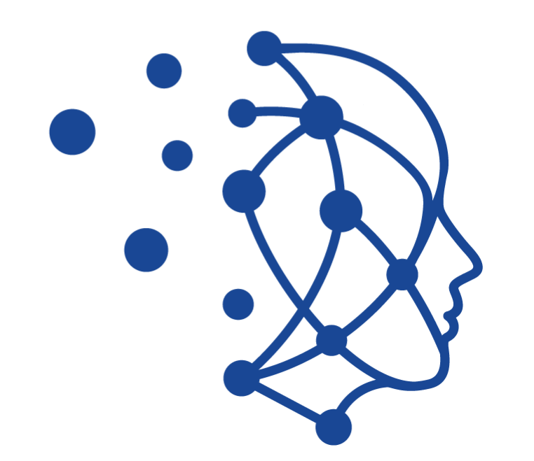

# Contributing a New Model

This guide will help you implement a new model in  PyC and enable its usage in  Conceptarium.

## Prerequisites

- Knowledge of how concepts, exogenous and latent variables are related in the model PGM
- Knowledge of what are the layers (i.e., the ParametricCPDs ) connecting such variables 
- Familiarity with inference strategy supported by the model(deterministic, sampling, etc.)

## Training Modes

PyC models support two training paradigms controlled by the `lightning` parameter:

### 1. Standard PyTorch Training (`lightning=False`, default)
- Model works as a pure PyTorch `nn.Module`
- Optimizer, loss function, and training loop must be defined manually and externally to the model definition
- Example: `examples/utilization/2_model/5_torch_training.py`

### 2. PyTorch Lightning Training (`lightning=True`)
- Initialize model **with** `lightning=True`, `loss`, `optim_class`, and `optim_kwargs` parameters
- Use Lightning Trainer for automatic training/validation/testing
- Inherits training logic from `BaseLearner` mixin
- Example: `examples/utilization/2_model/6_lightning_training.py`

## Implementation Overview

All bipartite models (encoder → concepts → tasks) extend `BaseBipartiteModel` from `torch_concepts.nn.modules.high.base.bipartite`. The base class provides:
- Automatic backbone and latent encoder handling
- Inference engine switching (train/eval)
- Forward pass implementation
- Loss and metrics filtering

**Your model only needs to implement `__init__`** to configure the specific architecture using `BipartiteModel`.

### High-Level API Implementation

```python
from typing import List, Optional, Union
from torch import nn

from torch_concepts import Annotations
from torch_concepts.nn import (
    BipartiteModel, 
    LazyConstructor,
    DeterministicInference
)

# Import your encoder and predictor layer types
from torch_concepts.nn.modules.low.encoders.linear import LinearLatentToConcept
from torch_concepts.nn.modules.low.predictors.linear import LinearConceptToConcept

from ..base.bipartite import BaseBipartiteModel


class YourModel(BaseBipartiteModel):
    """Your Model description.
    
    A unified model class that works as a pure PyTorch module by default,
    or as a Lightning module when lightning=True.
    
    Parameters
    ----------
    input_size : int
        Dimensionality of input features (after backbone if used).
    annotations : Annotations
        Concept annotations with labels, cardinalities, and distributions.
    task_names : Union[List[str], str]
        Names of task variables (subset of annotation labels).
    lightning : bool, default False
        If True, adds Lightning training capabilities.
        If False (default), works as pure PyTorch module.
    inference : BaseInference, optional
        Inference engine class for evaluation.
    train_inference : BaseInference, optional
        Inference engine class for training.
    **kwargs
        Additional arguments passed to BaseBipartiteModel.
    
    Examples
    --------
    >>> # Pure PyTorch module (default)
    >>> model = YourModel(input_size=8, annotations=ann, task_names=['task'])
    >>> out = model(query=['c1', 'task'], x=input_tensor)
    
    >>> # Lightning training enabled
    >>> model = YourModel(
    ...     lightning=True, input_size=8, annotations=ann, task_names=['task'],
    ...     loss=my_loss, optim_class=torch.optim.Adam, optim_kwargs={'lr': 0.001}
    ... )
    """
    
    def __init__(
        self,
        input_size: int,
        annotations: Annotations,
        task_names: Union[List[str], str],
        inference = DeterministicInference,
        train_inference = DeterministicInference,
        lightning: bool = False,
        **kwargs
    ):
        # Step 1: Call parent __init__ with standard parameters
        super().__init__(
            input_size=input_size,
            annotations=annotations,
            task_names=task_names,
            lightning=lightning,
            **kwargs  # Passes backbone, loss, metrics, optim_class, etc.
        )
        
        # Step 2: Build the bipartite model architecture
        # Use LazyConstructor to automatically instantiate layers for each concept
        self.model = BipartiteModel(
            task_names=task_names,
            input_size=self.latent_size,  # Output size from latent encoder
            annotations=annotations,
            encoder=LazyConstructor(LinearLatentToConcept),      # latent → concepts
            predictor=LazyConstructor(LinearConceptToConcept)    # concepts → tasks
        )

        # Step 3: Initialize inference engines
        self.eval_inference = inference(self.model.probabilistic_model)
        self.train_inference = train_inference(self.model.probabilistic_model)
```

### Key Implementation Points

1. **Only implement `__init__`**: The `forward`, `filter_output_for_loss`, and `filter_output_for_metrics` methods are inherited from `BaseBipartiteModel` and work for most cases.

2. **Use `self.latent_size`**: After `super().__init__()`, this property gives you the output dimension of the latent encoder (to pass to `BipartiteModel`).

3. **Use `LazyConstructor`**: This automatically instantiates your encoder/predictor layers for each concept with the correct input/output dimensions.

4. **Set both inference engines**: Always set `self.eval_inference` and `self.train_inference`. They can be the same class or different (e.g., `DeterministicInference` for eval, `IndependentInference` for training).

### When to Override `forward`

The default `forward` in `BaseBipartiteModel` handles most cases:

```python
def forward(self, query, x=None, evidence=None, *args, **kwargs):
    if x is not None:
        features = self.maybe_apply_backbone(x)
        latent = self.latent_encoder(features)
        evidence['input'] = latent
    return self.inference.query(query, evidence=evidence, *args, **kwargs)
```

**Override `forward` when:**

| Scenario | Example |
|----------|---------|
| **Custom preprocessing** | Apply normalization, augmentation, or feature transformations before the latent encoder |
| **Multiple inputs** | Model takes multiple input tensors (e.g., image + metadata) |
| **Custom evidence structure** | Need to populate evidence dict with additional keys beyond `'input'` |
| **Post-processing** | Apply transformations to inference output (e.g., scaling, clipping) |
| **Multiple outputs** | Need to return additional outputs to the concepts |


### When to Override `filter_output_for_loss`

The default implementation passes model output directly to the loss function:

```python
def filter_output_for_loss(self, forward_out, target):
    return {'input': forward_out, 'target': target}
```

**Override when:**
Need additional inputs to a custom loss, e.g., regularization or auxiliary loss terms.

### When to Override `filter_output_for_metrics`

The default implementation passes model output directly to metrics:

```python
def filter_output_for_metrics(self, forward_out, target):
    return {'preds': forward_out, 'target': target}
```

**Override when:** Need additional inputs to custom metrics.


### 1.3 Mid-Level API Implementation

For custom architectures using `Variables`, `ParametricCPDs`, and `ProbabilisticGraphicalModel`:

```python
from torch_concepts import Variable, LatentVariable
from torch_concepts.distributions import Delta
from torch_concepts.nn import (
    ParametricCPD,
    ProbabilisticGraphicalModel,
    LinearLatentToConcept,
    LinearConceptToConcept,
    BaseInference,
    DeterministicInference
)


class YourModel(BaseBipartiteModel):
    """Mid-level implementation using Variables and ParametricCPDs.
    
    Use this approach when you need:
    - Custom concept dependencies
    - Non-standard graph structures
    - Fine-grained control over layer instantiation
    
    Supports both pure PyTorch (lightning=False) and Lightning (lightning=True) modes.
    """

    def __init__(
            self,
            input_size: int,
            annotations: Annotations,
            task_names: Union[List[str], str, List[int]],
            lightning: bool = False,
            inference: BaseInference = DeterministicInference,
            train_inference: Optional[BaseInference] = DeterministicInference,
            variable_distributions: Mapping = None,
            embs_precomputed: bool = False,
            backbone: Optional[callable] = None,
            encoder_kwargs: Dict = None,
            **kwargs
    ) -> None:
        super().__init__(
            input_size=input_size,
            annotations=annotations,
            task_names=task_names,
            lightning=lightning,
            variable_distributions=variable_distributions,
            embs_precomputed=embs_precomputed,
            backbone=backbone,
            encoder_kwargs=encoder_kwargs,
            **kwargs
        )

        # Step 1: Define embedding variable (latent representation from encoder)
        embedding = LatentVariable(
            "embedding",
            parents=[],
            distribution=Delta,
            size=self.encoder_out_features
        )
        embedding_cpd = ParametricCPD("embedding", parametrization=nn.Identity())

        # Step 2: Define concept variables
        concept_names = [c for c in annotations.get_axis_labels(1)
                         if c not in task_names]
        concepts = Variable(
            concept_names,
            parents=['embedding'],  # All concepts depend on embedding
            distribution=[annotations[1].metadata[c]['distribution']
                          for c in concept_names],
            size=[annotations[1].cardinalities[annotations[1].get_index(c)]
                  for c in concept_names]
        )

        # Step 3: Define task variables
        tasks = Variable(
            task_names,
            parents=concept_names,  # Tasks depend on concepts
            distribution=[annotations[1].metadata[c]['distribution']
                          for c in task_names],
            size=[annotations[1].cardinalities[annotations[1].get_index(c)]
                  for c in task_names]
        )

        # Step 4: Define concept encoder CPDs (layers)
        concept_encoders = ParametricCPD(
            concept_names,
            parametrization=[
                LinearLatentToConcept(
                    in_latent=embedding.size,
                    out_features=c.size
                ) for c in concepts
            ]
        )

        # Step 5: Define task predictor CPDs
        task_predictors = ParametricCPD(
            task_names,
            parametrization=[
                LinearConceptToConcept(
                    in_concepts=sum([c.size for c in concepts]),
                    out_features=t.size
                ) for t in tasks
            ]
        )

        # Step 6: Build Probabilistic Graphical Model
        self.pgm = ProbabilisticGraphicalModel(
            variables=[embedding, *concepts, *tasks],
            parametric_cpds=[embedding_factor, *concept_encoders, *task_predictors]
        )

        # Step 7: Initialize inference
        self.eval_inference = inference(self.pgm)

    def forward(
            self,
            x: torch.Tensor,
            query: List[str] = None,
            backbone_kwargs: Optional[Mapping[str, Any]] = None,
            **kwargs
    ) -> torch.Tensor:
        features = self.maybe_apply_backbone(x, backbone_kwargs)
        features = self.encoder(features)
        out = self.inference.query(query, evidence={'embedding': features})
        return out

    def filter_output_for_loss(self, forward_out):
        return forward_out

    def filter_output_for_metrics(self, forward_out):
        return forward_out
```

### 1.4 Key Components Explained

#### Variables
Represent random variables (concepts) in your model:
- `name`: Variable identifier(s) - string or list of strings
- `parents`: List of parent variable names
- `distribution`: Probability distribution class(es)
- `size`: Dimensionality (cardinality for discrete, feature dim for continuous)

```python
# Binary concept
concept = Variable("smoking", parents=['embedding'], 
                  distribution=Bernoulli, size=1)

# Categorical concept with 5 classes
concept = Variable("diagnosis", parents=['embedding'], 
                  distribution=Categorical, size=5)

# Multiple concepts at once
concepts = Variable(['age', 'gender', 'bmi'], 
                   parents=['embedding'],
                   distribution=[Delta, Bernoulli, Delta],
                   size=[1, 1, 1])
```

#### ParametricCPDs
Represent computational modules (neural network layers):
- `name`: ParametricCPD identifier(s) matching variable names
- `module_class`: PyTorch module(s) that compute the factor

```python
# Single factor
encoder = ParametricCPD("smoking", parametrization=LinearLatentToConcept(...))

# Multiple CPDs
encoders = ParametricCPD(['age', 'gender'], 
                 parametrization=[LinearLatentToConcept(...), LinearLatentToConcept(...)])
```

#### LazyConstructor
Utility for automatically instantiating modules for multiple concepts:

```python
# Creates one LinearLatentToConcept per concept
encoder = LazyConstructor(LinearLatentToConcept)
```

#### Inference
Controls how information flows through the model:
- `DeterministicInference`: Standard forward pass
- `AncestralSamplingInference`: Sample from distributions
- Custom inference: Extend `BaseInference` for specialized behavior

### 1.5 Available Layer Types

#### Encoders (Embedding/Exogenous → Logits)
```python
from torch_concepts.nn import (
    LinearLatentToConcept,      # Linear encoder from embedding
    LinearExogenousToConcept,     # Linear encoder from exogenous
    LinearLatentToExogenous,             # Creates exogenous representations
)
```

#### Predictors (Logits → Logits)
```python
from torch_concepts.nn import (
    LinearConceptToConcept,           # Linear predictor
    HyperlinearConceptExogenousToConcept,    # Hypernetwork-based predictor
    MixConceptExogegnousToConcept,    # Mix of endogenous and exogenous
)
```

#### Special Layers
```python
from torch_concepts.nn import (
    SelectorLatentToExogenous,          # Memory-augmented selection
    WANDAGraphLearner,       # Learn concept graph structure
)
```


## Part 2: Model Configuration File

Create a YAML configuration file at `conceptarium/conf/model/your_model.yaml`.

### 2.1 Basic Configuration

```yaml
defaults:
  - _commons
  - _self_

# Target class for Hydra instantiation
_target_: "torch_concepts.nn.modules.high.models.your_model.YourModel"    # Path to your model class

# Inference configuration
inference:
  _target_: "torch_concepts.nn.DeterministicInference"
  _partial_: true  # Partial instantiation (model will pass pgm)

# Add any model-specific parameters here
```

### 2.2 Common Configuration (`_commons.yaml`)

The `_commons.yaml` file defines shared parameters. Override them in the model config as needed.

```yaml
# Encoder MLP configuration
encoder_kwargs:
  hidden_size: 64
  n_layers: 1
  activation: leaky_relu
  dropout: 0.2

# Variable distributions for different concept types
variable_distributions:
  discrete_card1:  # Binary concepts
    path: "torch.distributions.RelaxedBernoulli"
    kwargs:
      temperature: 0.1
  discrete_cardn:  # Categorical concepts
    path: "torch.distributions.RelaxedOneHotCategorical"
    kwargs:
      temperature: 0.1
  continuous_card1:  # Continuous scalars
    path: "torch_concepts.distributions.Delta"
  continuous_cardn:  # Continuous vectors
    path: "torch_concepts.distributions.Delta"
```

## Part 3: Testing & Verification
Test your model thoroughly before submission. 


## Part 4: Integration & Submission
    
### 4.1 Documentation

Provide the following documentation:
1. **Model docstring**: Clear description of model architecture, parameters, and usage
2. **Citation**: If based on a paper, include proper citation
3. **Example usage**: If the model is somewhat peculiar, please create example in `torch_concepts/examples/models-usage/your_model.py`
4. **README entry**: Add entry and description to torch_concepts README

### 4.2 Contacting the Authors

**Important**: Contact the library authors before submitting to ensure your model fits the library's standards and get guidance.